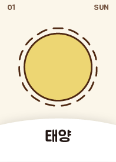
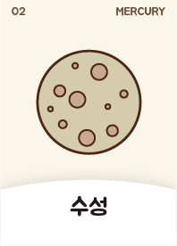
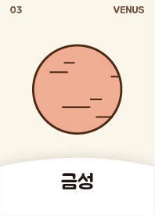
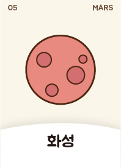
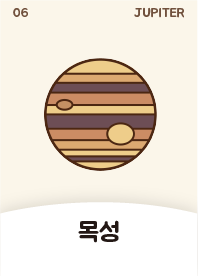
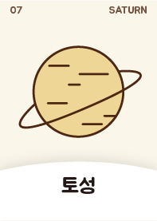
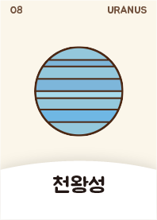
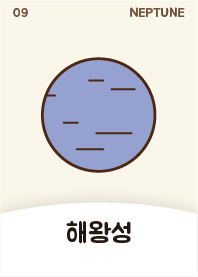

# AR_Solar_System_Edu

## Abstract

교육 목적 카드를 통한 태양계 행성 인식 AR  

**기능**  
1. 카드를 통한 행성 인식  
2. 행성 터치 시 해당 행성에 대한 정보 UI 표시, 다시 해당 행성 터치 시 정보 UI 없앰.
3. 화면 상 드로잉을 통해 필기 가능  
4. 드로잉 색상 팔레트 기능

### Cards.

     
    
    
